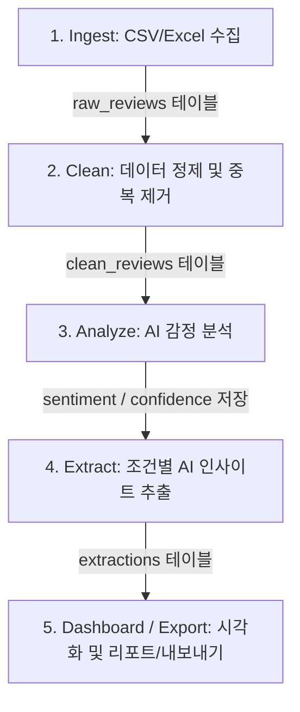

# reviewlens 실행 및 운영 매뉴얼

`reviewlens`는 대량의 고객 리뷰를 수집 및 정제하고, AI API를 활용해 감정을 분류하며, 비즈니스 인사이트(요약, 키워드, 개선 제안)를 도출한 후 차트와 HTML 대시보드로 시각화하는 CLI 기반 파이썬 애플리케이션입니다.

---

## 1. 환경 설정 및 설치

### 1.1 필수 요구 사양
- Python 3.12 이상 (Python 3.14 권장)
- SQLite3 (파이썬 기본 내장)

### 1.2 의존성 라이브러리 설치
프로젝트 루트 폴더에서 아래 명령을 실행하여 필요한 라이브러리를 설치합니다.
```bash
python -m pip install -r requirements.txt
```
* 주요 설치 패키지: `requests` (API 호출), `matplotlib` (차트 생성), `openpyxl` (Excel 지원)

### 1.3 LLM API 키 설정
AI 감정 분석 및 인사이트 추출을 수행하려면 Gemini API 키 설정이 필요합니다. 
프로젝트 루트에 `.env` 파일을 만들거나 환경변수를 설정해 주세요.
* **`.env` 파일 작성 시 (추천)**:
  ```env
  GEMINI_API_KEY=your_actual_api_key_here
  ```
* **터미널 환경변수 설정 시**:
  - Windows (PowerShell): `$env:GEMINI_API_KEY="your_key"`
  - macOS/Linux: `export GEMINI_API_KEY="your_key"`

---

## 2. 전체 워크플로우 아키텍처

비용 최적화와 안정적인 에러 복구를 위해 수집부터 시각화까지의 단계가 분리되어 있으며, SQLite DB(`data/reviews.db`)가 단계 사이의 상태를 공유합니다.



---

## 3. CLI 서브커맨드 상세 설명

명령어는 `python -m reviewlens <서브커맨드> [옵션]` 형식으로 실행합니다.

### 3.1 `import` (리뷰 데이터 수집)
외부 파일(CSV 또는 Excel)을 읽어와 가공되지 않은 상태인 `raw_reviews` 테이블에 적재합니다.
* **사용법**:
  ```bash
  python -m reviewlens import --file <파일경로>
  ```
* **예시 (CSV)**: `python -m reviewlens import --file data/sample_reviews.csv`
* **예시 (Excel)**: `python -m reviewlens import --file data/sample_reviews.xlsx`
* **특징**: 다양한 열 이름(리뷰, text, 별점, 평점, rating, 작성일, date 등)을 자동으로 매핑하여 수집합니다.

### 3.2 `add` (리뷰 1건 직접 수동 입력)
테스트를 위해 CLI에서 직접 리뷰 1건을 입력합니다.
* **사용법**:
  ```bash
  python -m reviewlens add --text "리뷰 본문" [--rating 5] [--product "제품명"] [--date "YYYY-MM-DD"]
  ```

### 3.3 `clean` (데이터 정제 및 중복 처리)
수집된 raw 데이터를 5대 정제 규칙에 따라 가공하여 `clean_reviews` 테이블로 이전합니다.
* **정제 규칙**: 필수필드(리뷰 텍스트/ID) 검증, 텍스트 정규화, 별점 범위 검증(1~5 이외는 NULL 처리하여 본문은 보존), 날짜 형식 통일(YYYY-MM-DD), 짧은 리뷰 필터링(10자 미만 기본값 제외)
* **옵션**:
  - `--policy [skip|upsert]`: 중복된 `review_id` 발견 시 처리 정책 (skip: 건너뛰기(기본값), upsert: 새 정보로 갱신)
  - `--all`: 이미 정제된 raw 리뷰도 처음부터 다시 정제
* **예시**: `python -m reviewlens clean --policy skip`

### 3.4 `analyze` (AI 기반 감정 분석)
정제된 리뷰 본문을 분석하여 **감정(긍정/부정/중립)**과 **신뢰도 점수(0.0 ~ 1.0)**를 판정해 기록합니다.
* **옵션**:
  - `--unanalyzed`: 아직 감정 분석이 진행되지 않은 리뷰만 분석 (기본값, 비용 절감)
  - `--all`: 이미 분석 완료된 건을 포함하여 전체를 다시 분석
  - `--id <리뷰ID>`: 특정 리뷰 1건만 단독 분석
  - `--limit <개수>`: 이번 요청에서 분석할 최대 리뷰 개수 제한
* **예시**: `python -m reviewlens analyze --limit 50`

### 3.5 `extract` (AI 기반 키워드 및 인사이트 추출)
특정 필터 범위의 리뷰들에서 긍정/부정 키워드, 전체 요약, 비즈니스 개선 제안, 우선순위 등을 종합 추출하여 저장합니다.
* **옵션**: `--sentiment`, `--product`, `--date-from`, `--date-to` 필터 지원
* **예시**: `python -m reviewlens extract --product "무선 이어폰 A"`

### 3.6 `list` (데이터 목록 조회)
감정, 별점, 날짜, 제품 등으로 필터링하고 페이지네이션 및 정렬하여 목록을 확인합니다.
* **옵션**:
  - `--page <페이지번호>` (기본: 1)
  - `--size <페이지당출력수>` (기본: 10)
  - `--sort [date|rating|confidence|id]` / `--asc` (오름차순 옵션, 기본은 내림차순)
* **예시**: `python -m reviewlens list --sentiment 부정 --rating-min 1 --page 1 --size 5`

### 3.7 `show` (리뷰 상세 조회)
지정한 리뷰 ID의 원문, 정제 상태, 다국어 판정 정보 및 AI 감정 분석 결과를 상세히 조회합니다.
* **예시**: `python -m reviewlens show R003`

### 3.8 `stats` (통계 요약 및 실시간 알림)
전체 리뷰의 누적 통계(평균 별점, 감정 분포 비율, 평균 신뢰도) 및 제품별 비교를 출력하며, 최근 부정 감정 비율이 급증한 경우 경고 알림을 표시합니다.
* **옵션**: `--as-of <YYYY-MM-DD>` (특정 날짜 기준으로 과거 감정 변화 알림 재점검)
* **예시**: `python -m reviewlens stats`

### 3.9 `dashboard` (대시보드 시각화 및 리포트 파일 생성)
통계 분석과 차트를 생성하고 최종 리포트 및 HTML 대시보드를 생성합니다.
* **생성물**:
  1. **차트 3종 (PNG)**: 감정 분포(도넛), 시간별 추이(누적 영역), 별점-감정 분포(누적 가로막대)
  2. **종합 리포트 (MD/TXT)**: 품질 지표 및 AI 추출 내용 통합 문서
  3. **단일 HTML 대시보드 (HTML)**: 모든 CSS와 base64 차트 이미지가 탑재된 단독 실행용 파일
* **옵션**:
  - `--format [md|txt]`: 리포트 텍스트 파일 포맷 지정
  - `--no-charts` / `--no-html`: 차트나 HTML 생성 제외 옵션
* **예시**: `python -m reviewlens dashboard --format md`

### 3.10 `export` (데이터 내보내기)
분석 완료된 데이터를 조건별로 필터링하여 외부 파일로 내보냅니다.
* **옵션**:
  - `--format [csv|jsonl|excel|both|all]`: 내보낼 파일 형식 (excel 및 all=전체 지원)
  - `--sentiment`, `--rating-min`, `--product` 필터링 지원
* **예시**: `python -m reviewlens export --format all --rating-min 4`

---

## 4. 문제 해결 및 팁 (FAQ)

### Q. 차트 이미지의 한글이 네모(□)로 깨져서 나옵니다.
* **원인**: Matplotlib가 구동되는 운영체제에 한글 폰트 링크가 깨져 있거나 지원 폰트가 없기 때문입니다.
* **해결**:
  - Windows: 기본적으로 `Malgun Gothic`을 사용하므로 정상 출력됩니다.
  - Linux (Ubuntu/Debian): 아래 명령으로 나눔 폰트를 설치하고 실행해 주세요.
    ```bash
    sudo apt-get install -y fonts-nanum
    ```

### Q. API 호출 중 HTTP 429 또는 401 오류가 발생합니다.
* **429 (Too Many Requests)**: 무료 API 키의 호출 쿼터 제한을 초과한 것입니다. 잠시 대기 후 `--limit` 옵션을 걸어 소량씩 분할 분석해 주세요.
* **401 (Unauthorized)**: `.env`에 설정된 `GEMINI_API_KEY` 값이 누락되었거나 비정상적일 때 발생하므로 API 키 설정을 재확인해 주세요.
